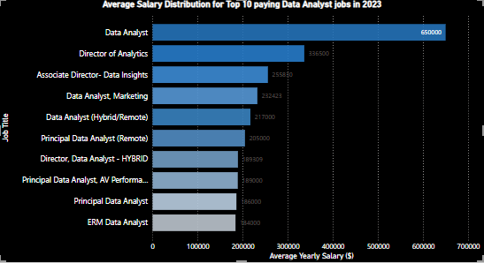
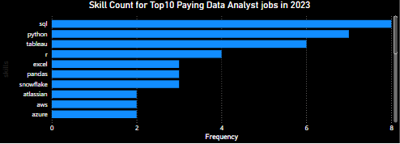
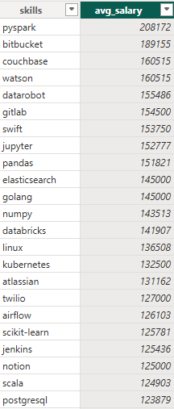
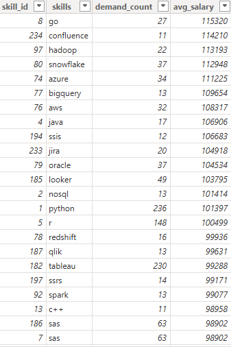

# Introduction
This project focuses on exploring top paying jobs, in-demand skills and where high demand meet high salary for data analyst roles in data analytics.

Check the sql queries here: [project_sql folder](/project_sql/)
# Background
Driven by a quest to navigate the data analyst job market more effectively, this project was born from a desire to pinpoint the top-paid and in-demand skills, streamlining others to find optimal jobs to apply for.

### The questions answered through this SQL queries were:

1. What are the top paying Data Analyst jobs?
2. What skills are required for these top-paying jobs?
3. What skills are most in demand for data analysts.
4. Which skills are associated with higher salaries?
5. What are the most optimal skills to learn?

# Tools Used
For my deep dive into the data analyst job market, I made use of several tools.

- **SQL:** The backbone of my analysis, allowing me to query the database and find insights.
- **PostgresSQL:** This is database management system i chose to use, ideal for handling data.
- **Visual Studio Code:** For database management and executing SQL queries.
- **Git and GitHub:** Essential for version control and sharing my SQL scripts and analysis, ensuring collaboration and project tracking.
- **Power BI:** This is the tool I used for visualizations. Ensuring clear picture of top paying jobs and skills.

# The Analysis
Each query aimed at investigating specific aspects ofthe data analysis job market.
Here is how I approched each question:

### 1.Top paying Data Analysis Jobs
To identify the top 10 paying roles, I filtered data analyst positions by average yearly salary and location, focusing on remote jobs. This query highlights the high paying opportunities in the field.
Below is the query:

```sql
SELECT
    job_id,
    job_title,
    job_location,
    job_schedule_type,
    salary_year_avg,
    job_posted_date,
    name AS company_name
FROM
    job_postings_fact
LEFT JOIN company_dim ON job_postings_fact.company_id = company_dim.company_id
WHERE 
    job_title_short = 'Data Analyst' AND
    job_location = 'Anywhere' AND
    salary_year_avg IS NOT NULL
ORDER BY 
    salary_year_avg DESC
    LIMIT 10;
```
Here is the breakdown of the top data analyst jobs in 2023:
- **Wide salary range:** Top paying data analyst roles span from $184,000 to $650,000, indicating significant salary potential in the field.
- **Diverse Employers:** Companies like SmartAsset, Meta, and AT&T are among top paying companies, showing a broad interest across different industries.
- **Job Title variety:** There is a high diversity in job titles, from Data Analyst to Director of Analytics, reflecting varied roles and specializations within data analytics.


*Bar graph visualizing the salary for the top 10 salaries for data analysts.*

### 2.Skills for Top Paying Jobs
To understand what skills are requiered for top paying jobs, I joined the job postings with the skills data, proving insights into what employers value for high paying roles.

```sql
WITH top_paying_jobs AS (
    SELECT
        job_id,
        job_title,
        salary_year_avg,
        name AS company_name
    FROM
        job_postings_fact
    LEFT JOIN company_dim ON job_postings_fact.company_id = company_dim.company_id
    WHERE 
        job_title_short = 'Data Analyst' AND
        job_location = 'Anywhere' AND
        salary_year_avg IS NOT NULL
    ORDER BY 
        salary_year_avg DESC
        LIMIT 10
)
SELECT
    top_paying_jobs.*,
    skills
FROM top_paying_jobs
    INNER JOIN skills_job_dim ON top_paying_jobs.job_id = skills_job_dim.job_id
    INNER JOIN skills_dim ON skills_job_dim.skill_id = skills_dim.skill_id
ORDER BY
    salary_year_avg DESC;
```

Here is the breakdown of the most demanded skills for the top 10 highest paying data analysis jobs in 2023:

- **SQL** Is leading with bold count of 8
- **Python** Following sql is python bold count of 7.
- **Tableau** with bold count of 6. Followed by  other skills such as R, excel,pandas,Snowflake and other skills.


*Bar graph visualizing the count of skills for the top 10 paying jobs for data analysts.*

### 3. In-Demand Skills for Data Analysts

This query helps identify the skills most frequently requested in the job postings.

``` sql
SELECT 
    skills,
    COUNT(skills_job_dim.job_id) AS demand_count
FROM job_postings_fact
INNER JOIN skills_job_dim ON job_postings_fact.job_id = skills_job_dim.job_id
INNER JOIN skills_dim ON  skills_job_dim.skill_id = skills_dim.skill_id
WHERE job_title_short = 'Data Analyst' AND
    job_work_from_home = TRUE
GROUP BY SKILLS
ORDER BY demand_count desc
limit 5;
```

Here is the breakdown of the most demanded skills for data analysts in 2023

- SQL and Excel remain fundamental, enthasizing the need for strong foundational skills in data processing and spreadsheet manipulation.
-Programing and Visualization Tools like Python, Tableau and PowerBI are essential.

| Skills  |  Demand Count|
|---------|--------------|
|SQL      |7291          |
|Excel    |4611          |
|Python   |4330          |
|Tableau  |3745          |
|PowerBI  |2689          |

*Table of the demand for the top 5 skills in data analyst job postings.*

### 4. Skills Based on Salary

Exploring the average salaries associated with different skills revealed which skills are the highest paying.

``` sql
SELECT 
    skills,
    ROUND(AVG(salary_year_avg),0) AS avg_salary
FROM job_postings_fact
INNER JOIN skills_job_dim ON job_postings_fact.job_id = skills_job_dim.job_id
INNER JOIN skills_dim ON  skills_job_dim.skill_id = skills_dim.skill_id
WHERE job_title_short = 'Data Analyst' AND
    salary_year_avg is NOT NULL AND
    job_work_from_home = TRUE
GROUP BY skills
ORDER BY avg_salary DESC
limit 25;
```
Here is the breakdown of the resultsfor top skills for data analysts;

- **High denand for big data and ML skills:** Top salaries are commanded by analysts skilled in big data technologies (Pyspark, Couchbase), machine learning tools (DataRobot, Jupyter) and python libraries(Pandas,NumPy).
-**Software Development:** Knowledge in development tools such as GitLab, kubernetes anD Airflow indicate lucrative crossover between data analysis and engineering.


Table of the average salary for the top 10 paying skills for data analysts.

### 5. Most Optimal skills to learn
This query aims to pinpoint skills that are both in high demand and have high salaries, offering a strategic focus on skill development.

``` sql
SELECT 
    skills_dim.skill_id,
    skills_dim.skills,
    COUNT(skills_job_dim.job_id) AS demand_count,
    ROUND(AVG(salary_year_avg),0) AS avg_salary
FROM job_postings_fact
INNER JOIN skills_job_dim ON job_postings_fact.job_id = skills_job_dim.job_id
INNER JOIN skills_dim ON  skills_job_dim.skill_id = skills_dim.skill_id
WHERE job_title_short = 'Data Analyst' AND
    salary_year_avg is NOT NULL AND
    job_work_from_home = TRUE
GROUP BY 
    skills_dim.skill_id
HAVING 
    COUNT(skills_job_dim.job_id)>10
ORDER BY
    avg_salary DESC,
     demand_count
LIMIT 25;
```

Table of the most optimal skills for data analysts sorted by salary.

- Skills in specialized technoogies such as snowflakes,Azure, AWS and BigQuery show segnificant demand with relatively high average salaries, pointing towards the growing importance of cloud platforms and big data technologies in data analysis.
- **High Demand of Programming Languages:** Python and R stands out for their high demand. Despite the high demand, their average salaries are $101,397 for Python and $100,499 for R, indicating that proficiency in these languages is highly valued and also widely available.

# What I learned
I have learned how to master the art of advanced SQL and merging tables.
Leveled up my real-world puzzle solving skills, turning questions into insightful SQL queries.

# Conclusion 

### Insights

1. **Top-Paying Data Analyst Jobs:** The highest paying jobs for data analysts that allow remote work offer a wide range of salaries, the highest at $650,000.
2. **Skills for Top-paying Jobs:** The highest paying jobs for data analysts require advanced proficiency in SQL, suggesting it's critical skill for a top salary.
3. **Most In-Demand skills:** SQL is also the most in-demand skill in the data analyst job market, thus making it essential for data analyst job seekers.
4. **Skills with higher salaries:** Specialized skills such as SVN and Solidityare associated with the highest average salaries.
5. **Optimal skills for job market value:** SQL leads in demand and offers the highest average salary, positioning it as one of the most optimal skills for data analysts to learn.

### Closing Thoughts

This project enhanced my SQL skills and provided valuable insights into the data analyst job market. The findings from the analysis serve as a guide to prioritizing skill development and job search efforts. This exploration highlights the importance of continuous learning and adaptation to emerging trends in the field of Data Analytics.